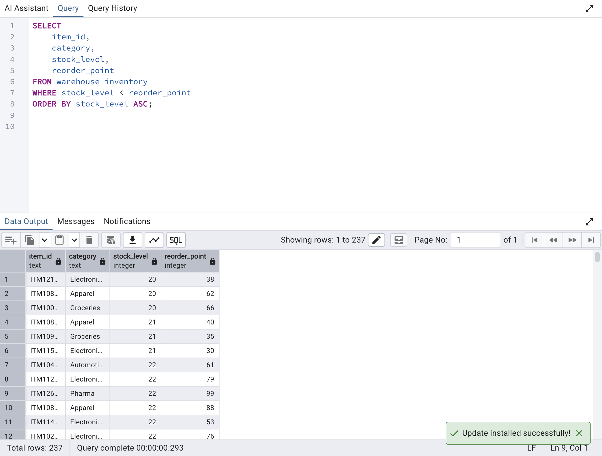
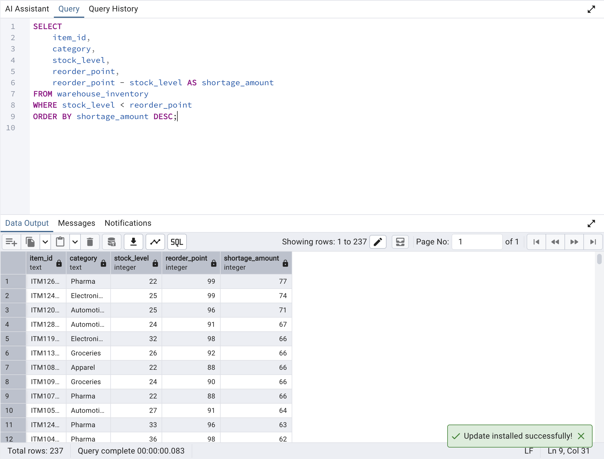
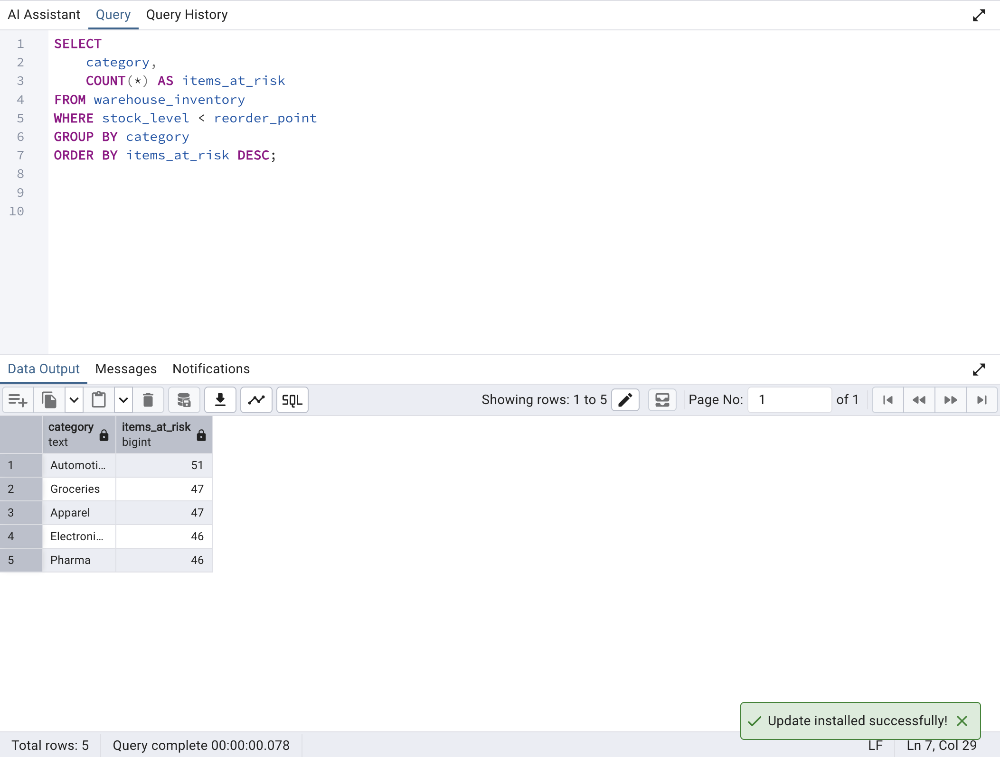
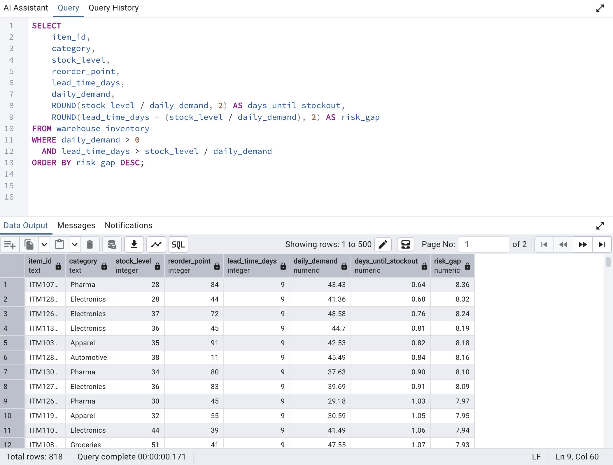

# Mining Supply Chain Inventory Risk Analysis

This project analyzes inventory risks in mining supply chains using SQL.

## Project Objective
This project analyzes inventory risk in a simulated supply chain environment using SQL.  
The goal is to identify potential stockouts, measure inventory shortages, and evaluate supplier lead time risks that may disrupt operations.

## Tools Used

- SQL
- PostgreSQL
- GitHub

## Dataset

Simulated mining supply chain dataset including:

- mine sites
- inventory levels
- supplier lead times
- reorder thresholds

## Key Analysis

1. Materials at risk of stockout
2. Supplier lead time impact on inventory
3. Inventory planning optimization

## Key Insights
## 1️⃣ Inventory Items at Risk of Stockout
### Explanation
This analysis identifies inventory items where the current stock level has fallen below the reorder threshold. These items are considered at risk of stockout because the remaining inventory may not be sufficient to sustain operations until new stock arrives.

### SQL Query
```sql
SELECT
    item_id,
    category,
    stock_level,
    reorder_point
FROM warehouse_inventory
WHERE stock_level < reorder_point
ORDER BY stock_level ASC;
```
### Result Visualization

### Result Insight
The analysis identified **237 inventory items** with stock levels below their reorder threshold. These items represent potential stockout risks and require immediate replenishment planning to avoid supply chain disruptions.

## 2️⃣ Inventory Shortage Severity Analysis
### Explanation
This analysis measures the severity of inventory shortages by calculating the difference between the reorder point and the current stock level. The larger the gap between these values, the more critical the shortage becomes.

### SQL Query
```sql
SELECT
    item_id,
    category,
    stock_level,
    reorder_point,
    reorder_point - stock_level AS shortage_amount
FROM warehouse_inventory
WHERE stock_level < reorder_point
ORDER BY shortage_amount DESC;
```
### Result Visualisation

### Result Insight
The analysis highlights inventory items with the largest gaps between stock levels and reorder thresholds. These items represent the most urgent replenishment priorities.

## 3️⃣ Category Inventory Risk Analysis
### Explanation
This analysis identifies which product categories contain the highest number of inventory items below their reorder point. By grouping at-risk items by category, the query highlights broader patterns in inventory management rather than focusing only on individual items.

### SQL Query
```sql
SELECT
    category,
    COUNT(*) AS items_at_risk
FROM warehouse_inventory
WHERE stock_level < reorder_point
GROUP BY category
ORDER BY items_at_risk DESC;
```
### Result Visualisation

### Result Insight
The results show which product categories have the greatest concentration of inventory risk. Categories with the highest number of at-risk items may indicate weaknesses in replenishment planning and should be prioritized for closer inventory monitoring.

## 4️⃣ Lead Time vs Stockout Risk Analysis
### Explanation
This analysis evaluates supply chain risk by comparing the estimated days until inventory stockout with supplier lead times. 

### SQL Query
```sql
SELECT
    item_id,
    category,
    stock_level,
    reorder_point,
    lead_time_days,
    daily_demand,
    ROUND(stock_level / daily_demand, 2) AS days_until_stockout,
    ROUND(lead_time_days - (stock_level / daily_demand), 2) AS risk_gap
FROM warehouse_inventory
WHERE daily_demand > 0
  AND lead_time_days > stock_level / daily_demand
ORDER BY risk_gap DESC;
```
### Result Visualisation 

### Result Insight
The results highlight products that may run out of stock before new inventory can arrive. These items require urgent replenishment planning, supplier acceleration, or increased safety stock levels to prevent supply chain disruptions.
